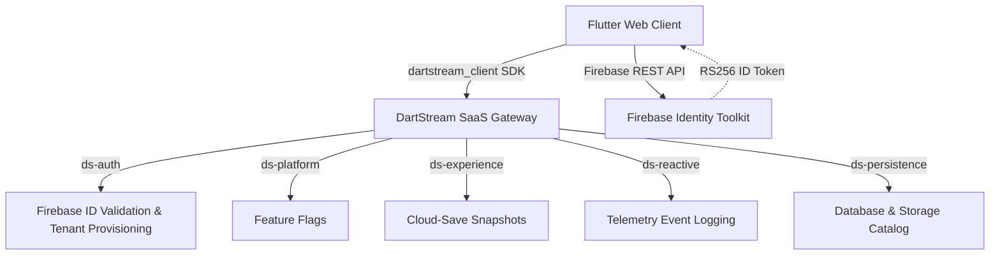
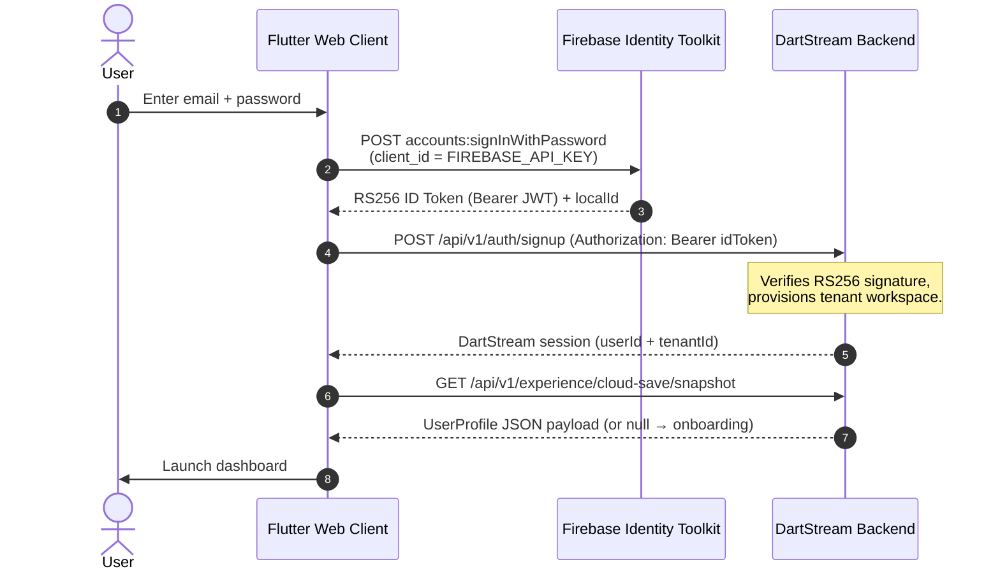

# Zᶻ Sleep Tracker — DartStream SaaS Reference Client

A premium, gamified sleep tracker built in **Flutter Web**. The app tracks real user sleep sessions, awards dynamic XP, and grows an animated companion plant along a Duolingo-style progression roadmap — all powered by live **DartStream SaaS** services.

---

## 🏗️ Architecture & Dataflow

The app is a first-party client reference consuming the `dartstream_client` pub.dev SDK. No mock data, no simulated backend — all services are live.



---

## 🔐 OAuth2 / Authentication

### Grant Type: Firebase Resource Owner Password → DartStream Bearer

This app uses the **Firebase Resource Owner Password Credentials grant** — the standard OAuth2 flow for first-party email/password clients:



### OAuth2 Credential Mapping

| OAuth2 Term | This App | Source |
|---|---|---|
| `client_id` | `FIREBASE_API_KEY` | Firebase Console → Project Settings → Web API Key |
| `client_secret` | `OAUTH_CLIENT_SECRET` | DartStream Dashboard → OAuth Clients |
| `client_registration` | `OAUTH_CLIENT_ID` | DartStream Dashboard → OAuth Clients |
| `access_token` | Firebase RS256 `idToken` | Issued by Firebase Identity Toolkit |
| `resource_server` | DartStream SaaS gateway | `dev-apiexperience.dartstream.io` etc. |

### Error Handling
- `DartStreamFirebaseAuthException` — wrong password, email not found, account disabled — surfaced in UI toast
- `DartStreamApiException` — typed API errors from DartStream services
- `401 / 403` → `clearAuthOnly()` + `onUnauthorized()` → redirects to `/login` (no silent fallback)

---

## 📂 Project Structure

```
sleep_tracker/
├── .github/workflows/ci.yml   # CI: analyze + test + build web on every push/PR
├── .env.example               # All required --dart-define keys (no secrets)
├── assets/lottie/             # Animated plant mascot stages (5 growth states)
├── lib/
│   ├── config.dart            # Compile-time env injection & OAuth2 documentation
│   ├── main.dart              # GoRouter config, 401 handler registration
│   ├── models/sleep_model.dart # UserProfile + SleepSession entities
│   ├── screens/
│   │   ├── home_screen.dart   # Sleep clock, XP engine, feature-flag-gated tracking
│   │   ├── levels_screen.dart # Winding mascot progression roadmap
│   │   ├── login_screen.dart  # Sign-in / sign-up with typed error handling
│   │   ├── onboarding_screen.dart # First-run profile setup
│   │   └── profile_screen.dart # Stats, display name & avatar management
│   ├── theme/app_theme.dart   # Design system tokens
│   └── utils/
│       ├── dartstream_manager.dart # SDK proxy: auth, cloud-save, events, 401 guard
│       ├── app_state.dart     # Shared ValueNotifier for cross-widget state
│       └── toast_helper.dart  # Styled error / success notifications
└── test/widget_test.dart      # MockClient contract tests (9 tests)
```

---

## 💾 Cloud-Save Data Model

All progress is a **single resumable snapshot** — last-write-wins, not an append log.

```json
{
  "payload": {
    "name": "Lalit Devda",
    "email": "lalit@example.com",
    "age": 25,
    "level": 3,
    "totalXp": 720,
    "sessions": [
      {
        "bedTime": "2026-06-28T22:30:00.000Z",
        "wakeTime": "2026-06-29T06:30:00.000Z",
        "hoursSlept": 8.0,
        "xpEarned": 164,
        "quality": 82
      }
    ]
  }
}
```

> The `{'payload': ...}` envelope is **required** by the DartStream cloud-save API contract. `DartStreamManager.saveUserData()` explicitly wraps the profile JSON in this envelope before calling `saveCloudSave()`.

---

## 👤 Profile Customization & Syncing

### Display Name Editing
When a user updates their display name:
1. Mutates the in-memory `UserProfile.name`
2. Persists to `SharedPreferences` (key: `'user_name'`)
3. Broadcasts via `AppState.userName` `ValueNotifier` → nav shell updates instantly
4. Pushes to cloud via `DartStreamManager.saveUserData()`

### Avatar Photo Management
- **Upload**: Browser file picker (`pickAndConvertImage()`) → base64 string → `UserProfile.avatar` → cloud sync
- **Clear**: Sets `UserProfile.avatar = null` → cloud sync → reverts to default

---

## ⚡ XP, Level & Plant Mascot System

### XP Rewards & Penalties

| Condition | XP Change |
|---|---|
| Session < 5 min (test abort) | −20 XP + quality penalty |
| Session < 1 hour | −15 XP |
| Session < 6 hours | −10 XP |
| Session 7–9 hours (optimal) | +Quality Score × 2 |
| All other healthy durations | +Quality Score × 1.5 |

### Level Formula
$$\text{Level} = \left\lfloor \frac{\text{totalXP}}{300} \right\rfloor + 1$$

Floor division means levels go **up and down** instantly as XP changes — no one-way ratchets.

### Feature Flags (live, with fallback)

Three flags read from `ds-platform` with `orElse` fallback `enabled: true`:

| Flag Key | Gates |
|---|---|
| `sleep_tracking_enabled` | Start/stop sleep button |
| `xp_rewards_enabled` | XP scoring on session end |
| `plant_growth_enabled` | Animated plant stage shown |

### Growth Stages

```
Mascot (Lvl 1) → Seedling (Lvl 2) → Walking (Lvl 3) → Garden (Lvl 4) → Master (Lvl 5+)
```

| Level | Stage | Asset |
|---|---|---|
| 1 | Sleep Mascot | `assets/lottie/mascot.json` |
| 2 | Magic Seedling | `assets/lottie/seedling.json` |
| 3 | Walking Plant | `assets/lottie/walking_pothos.json` |
| 4 | Pothos Garden | `assets/lottie/plants.json` |
| 5+ | Master Plant | `assets/lottie/waving_plant.json` |

---

## 🔑 Required `--dart-define` Values

All secrets are injected at **compile time** via `--dart-define`. No `.env` file is shipped as a web asset.

| Key | Required | Description |
|---|---|---|
| `FIREBASE_API_KEY` | ✅ Yes | Firebase Web API Key (OAuth2 client_id). Firebase Console → Project Settings → Web API Key |
| `OAUTH_CLIENT_ID` | ✅ Yes | OAuth2 client_id registered in DartStream Dashboard → OAuth Clients |
| `OAUTH_CLIENT_SECRET` | ✅ Yes | OAuth2 client_secret from DartStream Dashboard → OAuth Clients |

See `.env.example` for the full key list and instructions.

---

## 🚀 Local Development

```bash
# 1. Install dependencies
flutter pub get

# 2. Run on Chrome (supply all required defines)
flutter run -d chrome --web-port=3000 \
  --dart-define=FIREBASE_API_KEY=YOUR_KEY \
  --dart-define=OAUTH_CLIENT_ID=YOUR_CLIENT_ID \
  --dart-define=OAUTH_CLIENT_SECRET=YOUR_SECRET

# 3. Build production web bundle
flutter build web \
  --dart-define=FIREBASE_API_KEY=YOUR_KEY \
  --dart-define=OAUTH_CLIENT_ID=YOUR_CLIENT_ID \
  --dart-define=OAUTH_CLIENT_SECRET=YOUR_SECRET

# 4. Deploy to Firebase Hosting
firebase deploy --only hosting:sample-app-lalit-devda
```

---

## 🧪 Tests

Run the MockClient-injected contract tests (no network required):

```bash
flutter test --reporter=expanded
```

Tests cover:
- Cloud-save `{'payload': ...}` envelope contract
- `loadUserData` snapshot unwrapping
- `trackEvent` snake_case `event_type` regression
- 401 re-auth handler
- `UserProfile` XP/level floor division
- `SleepSession` JSON round-trip
- Feature flag `orElse` fallback

---

## 🛠️ DartStream CLI Integration

The project includes a `dartstream.yaml` manifest file at the root to validate project configuration.

### Installation

Install the `ds_dartstream` package containing the `dartstream` CLI globally:
```bash
dart pub global activate ds_dartstream 0.0.8
```

### Authentication

Authenticate the CLI on your machine using your DartStream API token:
```bash
dartstream login --token <YOUR_TOKEN> --api-url https://dev-api.dartstream.io
```

### Validation

Validate the project configuration and generated files:
```bash
dartstream validate --strict
```

---

## 🔄 CI/CD

GitHub Actions (`.github/workflows/ci.yml`) runs on every push and PR to `main`:

1. `flutter pub get`
2. `flutter analyze --no-fatal-infos`
3. `flutter test --reporter=expanded`
4. `flutter build web` (dummy `--dart-define`)

---

## 🌐 Live Demo

Hosted on Firebase Hosting: **https://sample-app-lalit-devda.web.app**
