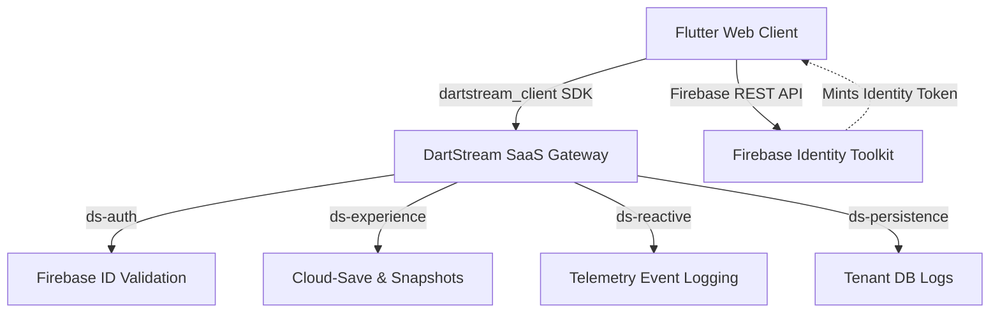
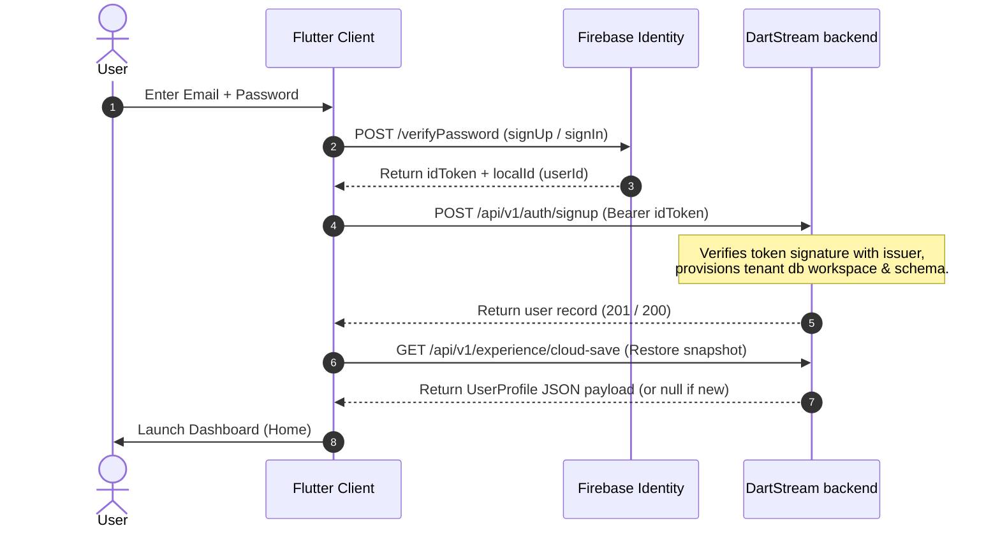

# Zᶻ Sleep Tracker (DartStream SaaS Reference Client)

A premium, gamified sleep tracker built in Flutter. This application tracks user sleep sessions, awards dynamic XP, and grows a companion plant mascot along a winding progression roadmap driven by live **DartStream SaaS** services.

---

## 🏗️ Architecture & Dataflow

The application acts as a customer client reference, consuming the first-party `dartstream_client` SDK to interface with DartStream SaaS development services.



### 1. Authentication & Onboarding Lifecycle
When a user signs up or signs in, the frontend runs a sequential initialization flow:



---

## 📂 Project Organization & File Map

```
sleep_tracker/
├── assets/                  # Graphics, weather animations, and mascot configs
│   └── lottie/              # plant growth stages json mascot files
├── lib/
│   ├── main.dart            # GoRouter configurations & initialization
│   ├── config.dart          # Environment variables & compile-time injection
│   ├── models/
│   │   └── sleep_model.dart # Core entities (SleepSession, UserProfile)
│   ├── screens/             # View layer
│   │   ├── home_screen.dart # Main tracker clock, greet panel, sleep history
│   │   ├── levels_screen.dart # Gamified snake roadmap progress timeline
│   │   ├── login_screen.dart # Authentication (Sign In & Register toggles)
│   │   ├── onboarding_screen.dart # Targets onboarding setup form
│   │   └── profile_screen.dart # Statistics summary, display name & avatar config
│   ├── state/
│   │   └── session.dart     # Shared DartStream active session proxy notifier
│   ├── theme/
│   │   └── app_theme.dart   # Styling theme HSL tokens
│   └── utils/
│       ├── dartstream_manager.dart # SDK proxy client implementations
│       ├── toast_helper.dart # UI notifications overlay
│       └── app_state.dart   # Shared routing state listeners
└── test/
    └── widget_test.dart     # Automated widget rendering validation
```

---

## 💾 Sleep Session Data Model & Cloud-Save

All user progress, metrics, and history are consolidated into a `UserProfile` snapshot, which is stored as a single, resumable **Cloud-Save** payload.

### Snapshot Payload Schema

```json
{
  "payload": {
    "name": "Lalit Devda",
    "email": "lalit@example.com",
    "age": 25,
    "level": 3,
    "totalXp": 720,
    "sessions": [
      {
        "bedTime": "2026-06-28T22:30:00.000Z",
        "wakeTime": "2026-06-29T06:30:00.000Z",
        "hoursSlept": 8.0,
        "xpEarned": 164,
        "quality": 82
      }
    ]
  }
}
```

* **Snapshoting mechanism**: The database updates operate on a *last-write-wins* snapshoting sequence via `saveCloudSave` and `loadCloudSave` using the `{'payload': ...}` structure.
* **CORS Preflight**: Real browser requests strip user headers, so user and tenant queries are passed via query parameters inside the `dartstream_client` request wrapper.

---

## 👤 Profile Customization & Syncing

The Profile screen manages customization fields which synchronize dynamically with both local memory and the cloud save payload:

### 1. Display Name Editing
* When a user updates their display name, the change is:
  * Buffered directly into the active `UserProfile` session.
  * Persisted locally using `SharedPreferences` (under the key `'user_name'`).
  * Broadcast to active navigation layouts via `AppState.userName` value listeners.
  * Pushed to the DartStream SaaS cloud-save store through `DartStreamManager.saveUserData()`.

### 2. Avatar Photo Management
* **Upload**: Tapping to upload prompts the user to select an image from their local machine using a browser-compatible selector (`pickAndConvertImage()`). This file is converted to a base64-encoded string and assigned to the user profile:
  $$\text{UserProfile.avatar} = \text{base64String}$$
* **Clear**: Reverting to the default avatar nullifies the field (`UserProfile.avatar = null`).
* **Cloud Persistence**: The updated user record containing the base64 avatar representation is saved to the cloud-save payload on the backend, allowing instant recovery across client platforms.

---

## ⚡ XP, Level, and Plant Mascot System

The sleep tracking engine dynamically awards and deducts XP based on sleep consistency and session duration:

### 1. XP Rewards & Penalties

* **Interrupted/Short Sleep Sessions**:
  * **Duration < 5 minutes (Testing)**: Deducts **-20 XP** and penalizes quality score.
  * **Duration < 1 hour**: Deducts **-15 XP**.
  * **Duration < 6 hours**: Deducts **-10 XP**.
* **Healthy Sleep Sessions**:
  * **Duration 7 - 9 hours**: Awards **Quality Score x 2** XP.
  * **Other Durations**: Awards **Quality Score x 1.5** XP.

### 2. Dynamic Level Division
Levels are computed mathematically based on floor division:
$$\text{Level} = \left( \frac{\text{Total XP}}{300} \right) + 1$$
This floor division allows seamless level-ups and level-downs during deductions.

### 3. Growth Stages Roadmap
Progression is displayed in a responsive winding Duolingo-style roadmap:

```
[ Mascot (Lvl 1) ] ➔ [ Seedling (Lvl 2) ] ➔ [ Walking (Lvl 3) ] ➔ [ Garden (Lvl 4) ] ➔ [ Master (Lvl 5+) ]
```

* **Lottie Plant Stages mapping**:
  1. **Level 1**: **Sleep Mascot** (`assets/lottie/mascot.json`)
  2. **Level 2**: **Magic Seedling** (`assets/lottie/seedling.json`)
  3. **Level 3**: **Walking Plant** (`assets/lottie/walking_pothos.json`)
  4. **Level 4**: **Pothos Garden** (`assets/lottie/plants.json`)
  5. **Level 5+**: **Master Plant** (`assets/lottie/waving_plant.json`)

---

## 🔑 Configuration & Local Running

1. **Resolve dependencies**:
   ```bash
   flutter pub get
   ```
2. **Inject Firebase API Web Key at compile time**:
   ```bash
   flutter run -d chrome --web-port=3000 --dart-define=FIREBASE_API_KEY=AIzaSy...
   ```
